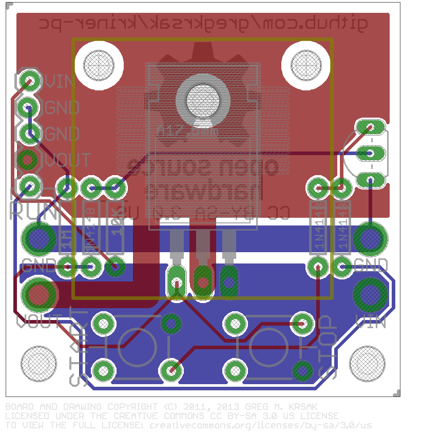
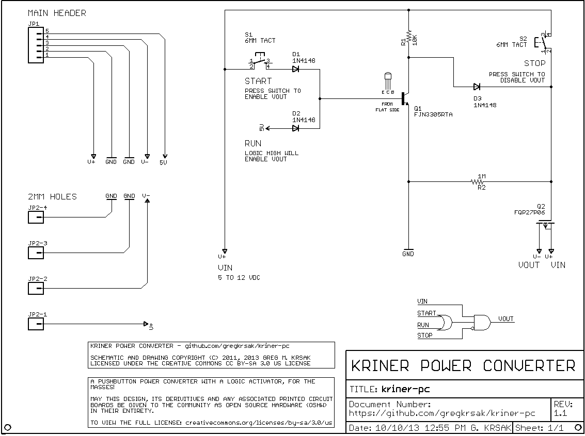

# Kriner Power Converter

[](images/kriner-pc-board.png)

A small open-source DC power switch with pushbutton controls and a separate logic-level enable input.

The Kriner Power Converter is designed to switch relatively high-current DC loads either from a microcontroller or from controls directly on the board. No firmware is required.



## What it does

The board uses a P-channel MOSFET as a high-side switch between `VIN` and `VOUT`.

There are three ways to control the output:

- **START** — manually enables `VOUT` while pressed.
- **STOP** — manually disables `VOUT` while pressed.
- **RUN** — logic-high input that enables `VOUT`.

`STOP` takes priority over either START or RUN.

In other words:

| START | STOP | RUN | VOUT |
| --- | --- | --- | --- |
| Released | Released | Low | Off |
| Pressed | Released | Low | On |
| Released | Released | High | On |
| Pressed | Released | High | On |
| Any | Pressed | Any | Off |

The pushbuttons are momentary controls rather than latching ON/OFF switches.

## Specifications

| | |
| --- | --- |
| Input voltage | 5–12 VDC |
| Switching | P-channel MOSFET, high side |
| Manual controls | START / STOP |
| External control | Logic-high RUN input |
| PCB size | Approximately 38.1 × 38.1 mm (1.5 × 1.5 in) |
| Construction | Through-hole |
| PCB layers | 2 |
| CAD format | EAGLE 6.5.0 |
| Design revision | 1.1 |
| Firmware | None |

The design has been tested from **5–12 VDC** and has been used with loads up to **15 A with forced-air cooling**.

See [Current and thermal notes](#current-and-thermal-notes) before treating 15 A as a continuous design rating.

## Connections

### Main header — JP1

| Pin | Signal | Purpose |
| --- | --- | --- |
| 1 | `VIN` | Positive supply input |
| 2 | `GND` | Ground |
| 3 | `GND` | Ground |
| 4 | `VOUT` | Switched positive output |
| 5 | `RUN` | Logic-high enable |

The board silkscreen identifies the same connections as:

`VIN` · `GND` · `GND` · `VOUT` · `RUN`

The RUN signal is named `5V` internally in the EAGLE schematic. It is intended as a logic-level control input for devices such as microcontrollers. A formal input-high threshold is not specified, so verify compatibility when using logic levels other than 5 V.

### 2 mm power connections

The board also provides separate 2 mm through-hole connections for:

- `VIN`
- `VOUT`
- `GND`
- `GND`

These provide an alternative to carrying load current through the main header.

## Circuit

The switching stage is built around an **FQP27P06 P-channel MOSFET** (`Q2`).

An **FJN3305RTA NPN transistor** (`Q1`) and three **1N4148** diodes combine the START and RUN inputs and control the MOSFET gate. The STOP switch acts directly on the gate-control network so that it overrides an asserted enable signal.

The basic logic is:

```text
                 +------ START button
                 |
Enable ----------+------ RUN logic input
                 |
                 v
          NPN control stage
                 |
                 v
VIN ------ P-channel MOSFET ------ VOUT
                 ^
                 |
                 +------ STOP button
```

This is a switch, not a voltage regulator: when enabled, `VOUT` is the switched version of `VIN`.

## Main components

| Ref. | Part | Description |
| --- | --- | --- |
| Q1 | FJN3305RTA | NPN transistor |
| Q2 | FQP27P06 | P-channel power MOSFET, TO-220 |
| D1–D3 | 1N4148 | Small-signal diodes |
| R1 | 10 kΩ | Resistor |
| R2 | 1 MΩ | Resistor |
| S1 | 6 mm tactile switch | START |
| S2 | 6 mm tactile switch | STOP |
| JP1 | 1×5 PTH header | Main connection header |

The PCB also includes two mounting/standoff holes and four dedicated 2 mm power connection holes.

## Schematic



The EAGLE schematic and board layout are included in the repository and can be modified directly.

## Repository layout

```text
kriner-pc/
├── eagle/
│   ├── kriner-pc.brd
│   └── kriner-pc.sch
├── images/
│   ├── kriner-pc-board.png
│   ├── kriner-pc-schmatic.png
│   └── oshw-logo-600-px-mirror.bmp
├── .gitignore
├── LICENSE
└── README.md
```

## Current and thermal notes

The Kriner Power Converter is an open-source hardware design rather than a fully characterized commercial power module.

The circuit has been tested from 5–12 VDC has the potential to be used with loads up to 15 A with forced-air cooling. That figure should not be interpreted as a guaranteed continuous-current rating under arbitrary conditions.

Actual current capability depends on factors including:

- MOSFET dissipation and heatsinking
- PCB copper temperature
- airflow
- wiring and connector resistance
- ambient temperature
- load characteristics
- startup and inrush current

Additional characterization would be useful for:

- inrush current
- MOSFET power dissipation
- turn-on time
- turn-off time

For a new application, verify electrical and thermal behavior under the actual intended load.

## Project status

The EAGLE design files identify the current board as **Revision 1.1**.

Potential future work tracked in the repository includes:

- inrush-current characterization
- power-dissipation documentation
- turn-on and turn-off timing
- validation of a physical Rev. 1.2 board
- migration of the schematic to KiCad

The EAGLE `.sch` and `.brd` files are the canonical design files for the project.

## Open-source hardware

The Kriner Power Converter is open-source hardware. The schematic, PCB layout, and derived boards may be studied, modified, and shared under the terms of the project license.

The design and drawings are licensed under the **Creative Commons Attribution-ShareAlike 3.0 United States License (CC BY-SA 3.0 US)**.

See [LICENSE](LICENSE) for the complete license text.

---

Designed by **Greg M. Krsak**.